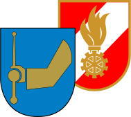

# [ffwenns](https://ffwenns.app)



In 2008 we have started to work on our graduation project with the title:

> Gestaltung einer Website für die Freiwillige Feuerwehr Wenns
>
> – Öffentlichkeitsarbeit einer Non-Profit-Organisation

As it turned out, the site got quite successful and rich of content. In 2012, as I went to [college](https://it-kolleg-imst.at), I wanted to do a relaunch, but failed totally. A few years later, another team of graduates from the same school came up with a new site, but didn't succeed either. While at the same time the fire department decided to just publish their posts on Facebook.

[This project](https://ffwenns.app) aims to merge all the news from more of a decade and wants to **ensure history, present and future** of public relations. The work that has been done by many volunteers all over time. 24 hours a day, 7 days a week, 365 days a year. Everyday, all the time, always on duty for the people.

## Migrate

To migrate posts, run `yarn link` before you're able to call:

```
ffw
```

This command is responsible for migrations, including:

- [x] ~ **600 posts** from wordpress back in the day
- [ ] all the posts on Facebook and Instagram

but will be also able to automate the import of upcoming news and export PDFs for backup locally.
